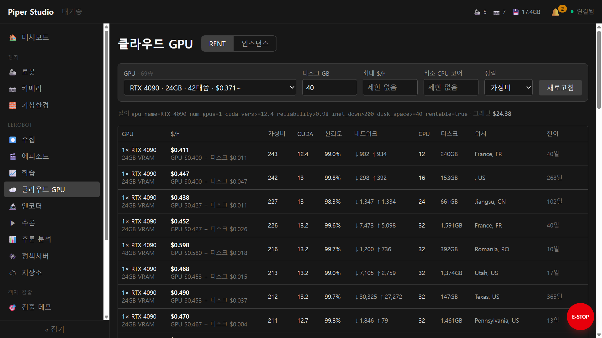

<!-- 초안 — 지금 README.md 와 비교하려고 따로 둔다. 뼈대는 feature/readme-rewrite.md §3.
     아직 없는 것: docs/install.md (순서 1), 클라우드 GPU·가상환경 스크린샷 (순서 3).
     그 자리는 주석으로 비워 뒀다 — 깨진 이미지 링크를 남기지 않는다. -->

# Piper Studio

**로봇에게 일을 가르치는 한 바퀴를 브라우저에서 돈다.** 팔과 카메라를 등록하고, 시범을 보여
데이터를 모으고, 학습을 걸고, 학습된 정책을 실제 팔에서 돌려 성공률을 남긴다 — 같은 화면에서.

[LeRobot](https://github.com/huggingface/lerobot) 위에 올라간다. LeRobot 을 바꾸지 않고
**감싼다** — 터미널에서 하던 것을 그대로 하되, 무엇이 도는지 보이고 중간에 멈출 수 있다.


## 이 물건이 푸는 것

모방학습은 단계마다 터미널 명령이고, 그 사이를 사람이 손으로 잇는다. 그러면 이런 일이 난다.

| 터미널에서 | 여기서는 |
|---|---|
| 인자 수십 개짜리 명령을 단계마다 다시 적는다 | 화면에서 고르고, **실제로 도는 명령을 그대로 보여 준다** |
| 정책이 무엇을 보고 있는지 모른 채 돈다 | 카메라·관절·필터 값이 도는 동안 화면에 |
| 파라미터를 바꾸려면 재시작한다 | 안전한 것은 **돌면서** 바뀐다 (버스로 정책 객체에 직접) |
| 화면이 얼면 팔은 계속 간다 | **E-stop 이 웹과 다른 프로세스**다 — 아래 참고 |
| 데이터셋·체크포인트·로그가 캐시에 흩어진다 | 데이터 루트 하나, 화면에서 찾고 편집한다 |
| 리더암과 사람이 있어야 데이터가 모인다 | 시뮬레이터에서 **사람 없이** 모을 수 있다 |

## 한 바퀴

### 1. 등록 — 무엇이 꽂혀 있나

<table><tr>
<td><br><sub>CAN 포트를 훑어 팔을 등록하고 역할(리더/팔로워)을 준다</sub></td>
<td><br><sub>카메라를 훑어 등록하고, 노출·화이트밸런스를 <b>프로파일로 고정</b>한다</sub></td>
</tr></table>

카메라 설정을 고정하는 것이 뒤에서 값을 한다 — 조명이 바뀐 채 모은 데이터는 나중에 못 가린다.
회색 카드로 색·밝기를 맞춰 잠그고, 그 뒤로 **조명이 흔들리면 화면이 말한다.**

### 2. 수집 — 시범을 보여 준다


리더암으로 끌거나, 리더암 없이 **키보드·마우스로** 조종한다. 에피소드마다 무엇을 하는
작업인지 적고, 잘못 모은 에피소드는 데이터셋 편집에서 골라 지운다.

### 3. 돌아보기 — 모은 것이 쓸 만한가


에피소드를 다시 재생하면서 관절·그리퍼 신호를 함께 본다. 구간마다 **작업 단계를 라벨**로
달아 둘 수 있다 — 어디서 실패했는지를 영상이 아니라 표로 찾게 된다.

### 4. 학습 — 이 기계에서, 또는 빌린 GPU 에서

<table><tr>
<td><br><sub>손실 곡선과 로그가 도는 동안 화면에 온다</sub></td>
<td><br><sub>GPU 가 없거나 모자라면 빌린다 — <b>고르기 전에</b> 값과 조건을 나란히 본다</sub></td>
</tr></table>

GPU 가 없거나 모자라면 **클라우드 GPU 를 빌려** 같은 화면에서 학습을 건다 — 빌리고, 올리고,
학습하고, 가중치를 도로 가져오고, 기계를 끄는 것까지.

돈이 나가는 일이라 **고르기 전에 보여 준다.** 시간당 값이 GPU 와 디스크로 쪼개져 있고,
가성비 순으로 세우며, CUDA 빌드·신뢰도·회선 속도·위치·남은 임대 가능 기간이 한 줄에 온다.
남은 크레딧도 같이 뜬다. 고른 뒤에도 **빌려 둔 기계가 놀고 있으면 지금까지 얼마 나갔는지와
함께** 경고하고, 아무도 관리하지 않는 기계는 따로 훑어 알린다.

### 5. 추론·평가 — 실제로 되나


학습된 정책을 팔에 걸고, **돌면서** 스무딩·실행 구간 같은 값을 만진다. 성공·실패를 남기면
체크포인트별·설정별 성공률이 쌓인다 — 다음에 무엇을 고를지가 기억이 아니라 숫자가 된다.

## 팔이 없어도 된다

MuJoCo 시뮬레이터가 **또 하나의 로봇 데몬**으로 붙는다. 실기와 같은 계약(공유 메모리 세그먼트)을
발행하므로 수집·학습·추론·E-stop 경로가 **한 줄도 안 바뀐 채** 시뮬 위에서 돈다.

- 시뮬 팔이 실기 팔과 **FK 0.00mm / 0.00°** (같은 공식 URDF 로 대조)
- 테이블 위 물건을 **JSON 으로 정의**하고 화면에서 고친다 — 상자·원기둥·통, 스캔해 온 메시까지
- **사람 없이** 에피소드를 만든다: 집기-놓기 한 바퀴가 11.9초, 20 에피소드에 약 4분

<!-- 필요: 가상환경 편집기 화면 (물체 목록 + 탑뷰 배치) → docs/images/scene.jpg -->

**GPU 없는 PC 에도 깔린다.** 수집·시뮬레이션·조종은 GPU 없이 되고, 학습·추론만 NVIDIA GPU 가
필요하다 — 수집용 기계와 학습용 기계를 나눠 둘 수 있다.

## 멈추는 것이 먼저다

E-stop 은 **웹서버와 분리된 독립 프로세스**다. 브라우저가 heartbeat 를 보내고, 그게 끊기면
(탭이 얼거나, 네트워크가 끊기거나, 웹서버가 죽거나) 워치독이 **2.5초 안에** 움직이는 것을
정지시킨다 — 실측값이다.

장치도 한 프로세스가 독점한다. CAN 과 카메라는 각자의 데몬이 쥐고, 웹 컨테이너는 **장치를
아예 열지 않는다.** 하나가 죽어도 나머지는 돈다.

## 어떻게 만들어졌나

```
[브라우저] ──nginx──→ [게이트웨이 (컨테이너)] ──→ LeRobot 프로세스
                            │
                    Redis 버스 · /dev/shm
                            │
   [estopd] [robotd] [camerad] [rsd] [simd]   ← 호스트 systemd 유저 유닛
      안전     CAN      카메라   RealSense  시뮬
```

웹은 컨테이너, 하드웨어를 쥐는 데몬은 호스트다. 둘은 **버스와 공유 메모리로만** 만난다.
컨테이너에 `privileged` 나 `/dev` 마운트가 필요해졌다면 그건 무언가가 아직 장치를 직접
열고 있다는 뜻이다.

자세한 3계층 다이어그램 → [docs/architecture-c4.drawio](docs/architecture-c4.drawio)

## 화면

| 묶음 | |
|---|---|
| 장치 | 로봇 · 카메라 · 가상환경 |
| LeRobot | 수집 · 데이터셋 · 에피소드 · 학습 · 클라우드 GPU · 모델 · 엔코더 · 추론 · 추론 분석 · 정책서버 · 저장소 |
| 객체 검출 | 검출 데모 · 검출 학습 |
| 통합 | 비전·판단 (검출 → LLM 판단 → 실행) |
| 시스템 | 로그 · 설정 |

그 밖에 대시보드와, 별도 창으로 뜨는 **조종 창**(키보드·마우스로 팔을 민다)이 있다.

## 설치

**스크립트 하나를 받아서 실행한다.** 나머지는 전부 이미지 안에 있다 — 데몬·wheel·udev
규칙·compose·설치 스크립트까지.

```bash
curl -fsSLO https://raw.githubusercontent.com/WeGo-Robotics/wego-piper-web/master/deploy/piper-install.sh
chmod +x piper-install.sh
./piper-install.sh
```

> ⚠ 처음 한 번은 **두 번 돌린다.** 스크립트는 sudo 가 필요한 일을 직접 하지 않고 명령을
> 찍고 멈춘다 — 무엇이 바뀌었는지 모르는 채로 끝나는 편이 더 나쁘다.
>
> 전제·포트·업데이트·제거 → [docs/install.md](docs/install.md) ·
> 막히면 → [트러블슈팅](docs/install-troubleshooting.md) (증상으로 찾는다)

끝나면 브라우저에서 **`http://<이 기계의 IP>/`**. 업데이트는 같은 스크립트이고, 직전 버전을
가진 기계가 받는 양은 실측 **104.5MB** 다.

## 더 읽을 것

| | 어디 |
|---|---|
| 설치·전제·업데이트·제거 | [docs/install.md](docs/install.md) |
| 설치가 멈추거나 장치가 안 보일 때 | [docs/install-troubleshooting.md](docs/install-troubleshooting.md) — 증상으로 |
| 자주 묻는 것 | [docs/qna.md](docs/qna.md) — 나온 말 그대로 |
| 버전마다 무엇이 달라졌나 | [CHANGELOG.md](CHANGELOG.md) |
| 개발 (저장소에서 직접 실행) · 아키텍처 | [CLAUDE.md](CLAUDE.md) |
| 릴리스 (이미지 굽기·배포) | [deploy/RELEASE-CHECKLIST.md](deploy/RELEASE-CHECKLIST.md) |
| 로봇 ↔ 데몬 계약 | [docs/robot-daemon-contract.md](docs/robot-daemon-contract.md) |
| 데이터 전처리 | [docs/data-preprocessing.md](docs/data-preprocessing.md) |
| 추론 CSV 로그 — 컬럼·분석 도구 | [docs/inference-logs.md](docs/inference-logs.md) |
| 진동 줄이기 | [docs/vibration_reduction.md](docs/vibration_reduction.md) |
| 라이선스 | [LICENSE](LICENSE) (Apache-2.0) · [THIRD-PARTY-NOTICES.md](THIRD-PARTY-NOTICES.md) |
