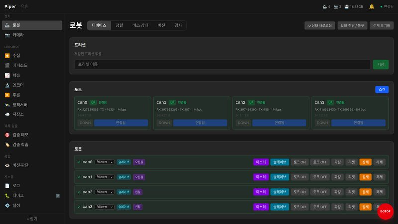
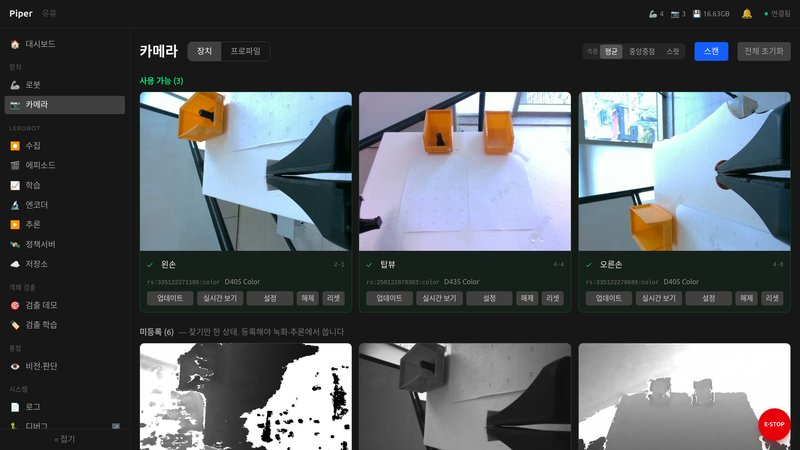
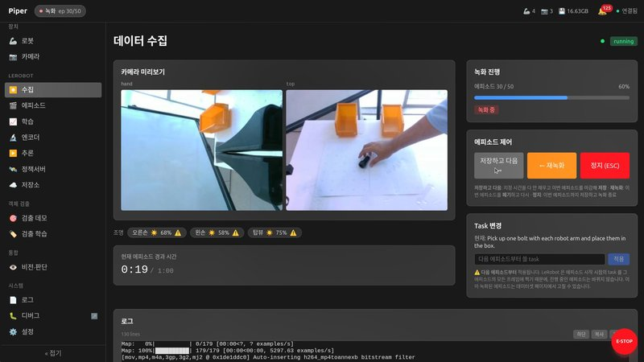
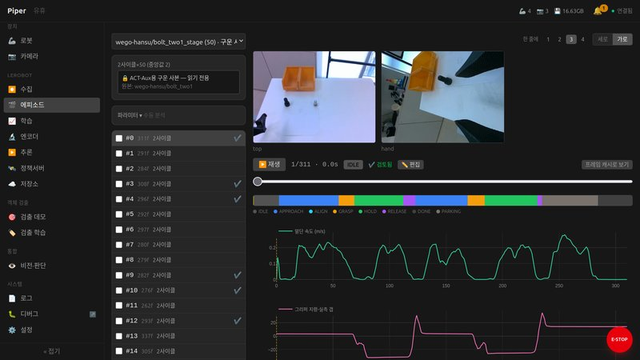
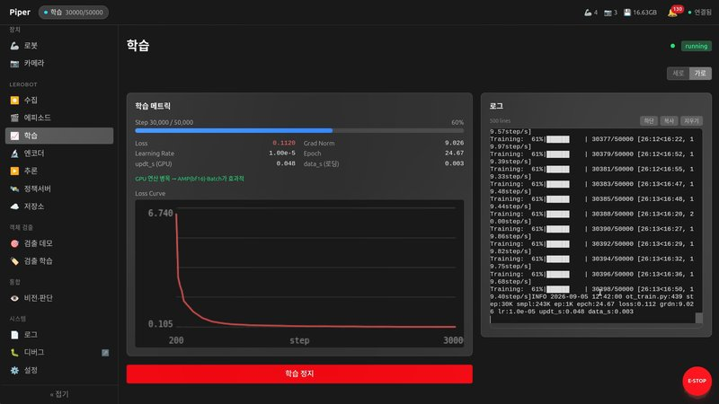
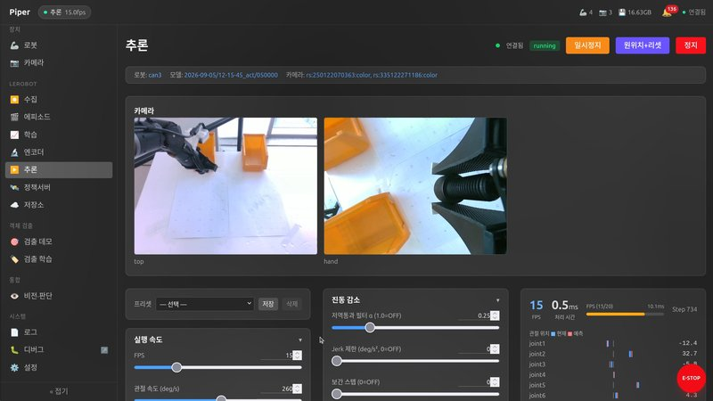
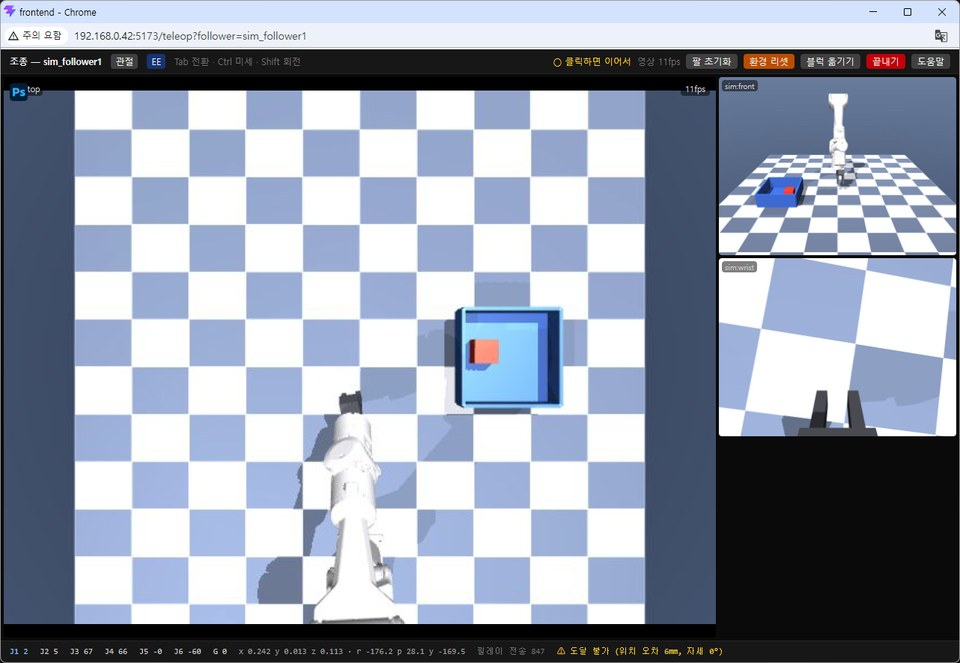

# Piper Studio

LeRobot 웹 인터페이스 — 로봇 모방학습 프레임워크를 웹에서 제어.
데이터 수집(에피소드 녹화), 추론·평가(체크포인트 배포, 실시간 파라미터 튜닝), 학습 모니터링,
비전 검출, 시뮬레이터, E-stop 안전 정지.

<table><tr>
<td><br><sub>로봇 — CAN 포트, 팔 등록·역할</sub></td>
<td><br><sub>카메라 — 스캔·프로파일·미리보기</sub></td>
</tr><tr>
<td><br><sub>수집 — 에피소드 녹화</sub></td>
<td><br><sub>에피소드 — 재생·페이즈·신호 그래프</sub></td>
</tr><tr>
<td><br><sub>학습 — 손실 곡선·메트릭·로그</sub></td>
<td><br><sub>추론 — 실시간 파라미터 튜닝</sub></td>
</tr></table>

**GPU 없는 PC 에도 깔린다.** 수집·시뮬레이션·조종은 GPU 없이 되고, 학습·추론만 NVIDIA GPU 가
필요하다 — 수집용 기계와 학습용 기계를 나눠 둘 수 있다.



MuJoCo 시뮬레이터 조종 창 — 리더암 없이 키보드·마우스로 팔을 움직이고, 탑뷰를 클릭해 블럭을 옮긴다.

## 설치

**스크립트 하나를 받아서 실행한다.**

```bash
curl -fsSLO https://raw.githubusercontent.com/WeGo-Robotics/wego-piper-web/master/deploy/piper-install.sh
chmod +x piper-install.sh
./piper-install.sh
```

나머지는 전부 이미지 안에 있다 — 데몬·wheel·udev 규칙·compose·설치 스크립트까지. 스크립트는
이미지를 받고(`docker pull`), 컨테이너를 **실행하지 않은 채** 파일만 꺼내(`docker create`), 꺼낸
`apply.sh` 가 전제 확인·udev·데몬 유닛·컨테이너까지 한다.

⚠ **처음 한 번은 두 번 돌린다.** 스크립트는 sudo 가 필요한 일을 직접 하지 않고 **명령을 찍고
멈춘다** — 무엇이 바뀌었는지 모르는 채로 끝나는 편이 더 나쁘다. 찍힌 명령을 실행하고,
**다시 로그인한다**(docker·video·dialout 그룹은 로그인해야 반영된다; NVIDIA 드라이버를 올렸으면
**재부팅**), 그리고 스크립트를 다시 돌린다. 이미 돼 있는 것은 건너뛰니 두 번째는 그냥 설치다.

끝나면 브라우저에서 연다 — **`http://<이 기계의 IP>/`** (같은 기계라면 `http://localhost/`).
포트는 80 이고 스크립트가 마지막 줄에 실제 주소를 찍어 준다(IP 는 `hostname -I`). 80 을 다른
것이 쓰고 있으면 **`PIPER_WEB_PORT=8081 ./piper-install.sh`** — 한 번 주면 업데이트에도 유지되고,
그러면 주소는 **`http://<이 기계의 IP>:8081/`** 이다(포트를 붙인다).

시뮬레이션(simd)·SO-101 리더암(so101d)은 **깔리되 꺼진 채**다 — 웹 [설정 → 서비스]에서 켜고
"부팅 시 시작"을 고른다. 재설치해도 그 선택은 그대로다.

멈추거나, 끝났는데 뭔가 안 보이면 → [docs/install-troubleshooting.md](docs/install-troubleshooting.md)
(증상으로 찾는다). 자주 묻는 것(접속 주소·포트 바꾸기·GPU 없는 기계·제거) → [docs/qna.md](docs/qna.md).

### 업데이트 · 제거 — 같은 자리에서

```bash
./piper-install.sh              # 최신 — 바뀐 레이어만 받는다 (~100MB)
./piper-install.sh v0.4.18      # 특정 버전
./piper-install.sh --check      # 아무것도 안 바꾸고 상태만
PIPER_WEB_PORT=8081 ./piper-install.sh              # 80 대신 다른 포트 (한 번 주면 유지)
PIPER_IMAGE=<주소>/piper-web-backend ./piper-install.sh   # 다른 레지스트리에서
```

웹 [설정 → 서비스 → 업데이트]로도 된다. 제거는 `piper-uninstall.sh` — 같은 자리에서 받는다:

```bash
curl -fsSLO https://raw.githubusercontent.com/WeGo-Robotics/wego-piper-web/master/deploy/piper-uninstall.sh
chmod +x piper-uninstall.sh
./piper-uninstall.sh                # 유닛·컨테이너·이미지·venv·배포 디렉토리 — 데이터는 남긴다
./piper-uninstall.sh --purge-data   # ⚠ 데이터셋·모델·설정까지 (--dry-run 으로 먼저 본다)
```

## 필요한 것

| | |
|---|---|
| OS | Ubuntu 22.04 이상 — 시스템 Python **3.10 이상** (20.04 는 OS 를 올려야 한다) |
| docker · docker compose v2 | 사용자가 `docker` 그룹에 있을 것 |
| GPU (학습·추론) | NVIDIA 컴퓨트 능력 **7.5 이상**(Turing / RTX 20xx·T4), 드라이버 CUDA **13.0 이상**, nvidia-container-toolkit. Pascal·Volta 는 드라이버를 올려도 안 된다 |
| 팔 | USB-CAN 어댑터 + **이 머신에서** 만든 CAN 이름 규칙 — 없으면 포트를 바꿔 꽂는 순간 두 팔 이름이 뒤바뀐다 (만드는 법은 [트러블슈팅](docs/install-troubleshooting.md) 9절) |

GPU 가 **아예 없는 기계**에도 깔린다 — 학습·추론만 빠지고 수집·시뮬레이터·조종 창은 된다.
그 밖의 전제(redis·udev 규칙·linger·python3-venv)는 스크립트가 확인하고 명령을 찍어 준다.

## 어디서 도나, 데이터는 어디에

웹(게이트웨이·프론트)은 **컨테이너**, 하드웨어를 쥐는 데몬(estopd·robotd·camerad·rsd·simd·so101d)은
**호스트 systemd 유저 유닛**(`systemctl --user`)이다. 둘은 호스트 Redis(유닉스 소켓)와 `/dev/shm`
세그먼트로만 만난다.

| 호스트 | 컨테이너 | 용도 |
|---|---|---|
| `${PIPER_DATA_ROOT:-/srv/piper-data}` | `/data` | 데이터 전부 (hf 캐시·outputs·logs·config) |
| `/run/redis` | `/run/redis` | 버스 유닉스 소켓 |

녹화한 데이터셋은 `~/.cache/huggingface/lerobot`, 설정은 `~/.config/piper-web`. **다시 깔거나
지워도 이 셋은 안 지운다.**

## 그 밖

| | 어디 |
|---|---|
| 개발 (저장소에서 직접 실행) · 아키텍처 | [CLAUDE.md](CLAUDE.md) |
| 버전마다 무엇이 달라졌나 | [CHANGELOG.md](CHANGELOG.md) |
| 릴리스 (이미지 굽기·배포) | [deploy/RELEASE-CHECKLIST.md](deploy/RELEASE-CHECKLIST.md) |
| 설치가 멈추거나 장치가 안 보일 때 | [docs/install-troubleshooting.md](docs/install-troubleshooting.md) — 증상으로 찾는다 |
| 자주 묻는 것 | [docs/qna.md](docs/qna.md) — 나온 말 그대로 찾는다 |
| 추론 CSV 로그 — 컬럼·분석 도구 | [docs/inference-logs.md](docs/inference-logs.md) |
| 라이선스 | [LICENSE](LICENSE) (Apache-2.0) · [THIRD-PARTY-NOTICES.md](THIRD-PARTY-NOTICES.md) |
