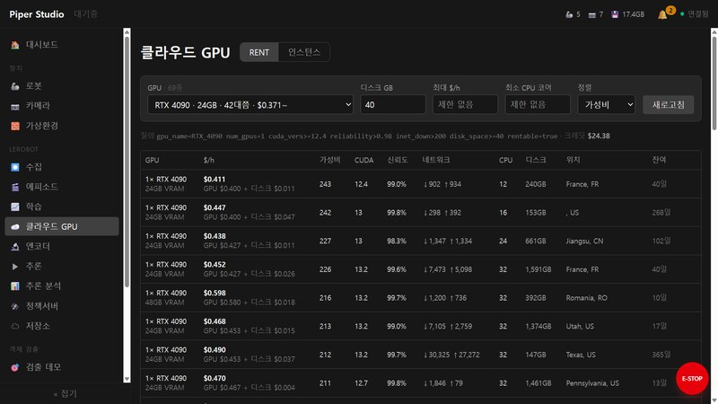
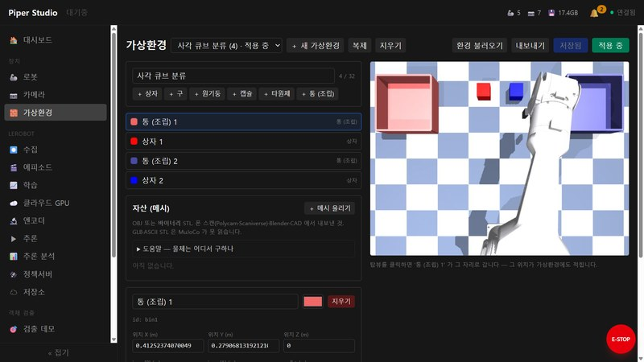

<!-- README.md 교체 검토용 초안. 제품 소개와 설치·운영 절차를 함께 담습니다. -->

# Piper Studio

**로봇 모방학습의 데이터 수집부터 학습·평가까지 브라우저에서 진행합니다.**

Piper Studio는 [LeRobot](https://github.com/huggingface/lerobot) 기반 웹 인터페이스입니다.
로봇과 카메라를 등록하고, 시범 데이터를 수집·검토하며, 학습한 정책(로봇의 행동을 결정하는 모델)을
실행해 평가 결과를 기록할 수 있습니다. 실행 명령과 로그를 화면에서 확인하고 작업을 제어합니다.

실물 로봇 없이 MuJoCo 시뮬레이터로 시작할 수 있습니다. GPU 없는 PC에서도 수집·시뮬레이션·조종이
가능하며, 학습에는 로컬 또는 클라우드 GPU를 사용할 수 있습니다.

[작업 흐름](#작업-흐름) · [시뮬레이션](#실물-로봇-없이-시작하기) ·
[시스템 구조](#정지-기능과-시스템-구조) · **[설치](#설치)** · [관련 문서](#관련-문서)


## 주요 기능

모방학습에서는 장치 설정, 데이터 수집, 학습, 평가를 반복합니다. Piper Studio는 이 과정에서
필요한 설정과 실행 상태, 결과를 웹 인터페이스로 연결합니다.

| 기능 | 할 수 있는 일 |
|---|---|
| 작업 실행·모니터링 | 화면에서 실행 조건을 설정하고 실제 명령, 로그, 진행 상태를 확인합니다. |
| 데이터 검토 | 에피소드를 재생하고, 작업 단계에 라벨을 달거나 불필요한 에피소드를 삭제합니다. |
| 로컬·클라우드 학습 | 로컬 GPU에서 학습하거나 클라우드 GPU를 임대해 학습하고 결과를 가져옵니다. |
| 추론·평가 | 실행 중 지원되는 파라미터를 조정하고 체크포인트·설정별 성공률을 비교합니다. |
| 시뮬레이션 | 가상환경을 구성하고 키보드·마우스 조종 또는 스크립트 시연으로 데이터를 수집합니다. |

## 작업 흐름

### 1. 장치 등록

CAN 포트를 검색해 로봇을 등록하고 리더·팔로워 역할을 지정합니다. 카메라는 미리보기로 확인하며
노출과 화이트밸런스를 프로파일로 저장합니다. 회색 카드를 이용한 보정과 조명 변화 알림으로
수집 환경을 관리할 수 있습니다.

<table><tr>
<td><br><sub>로봇 등록과 역할 설정</sub></td>
<td><br><sub>카메라 미리보기와 프로파일 설정</sub></td>
</tr></table>

### 2. 데이터 수집

리더암 또는 키보드·마우스로 로봇을 조종해 시범 데이터를 수집합니다. 한 번의 작업을
에피소드로 녹화하고, 각 에피소드에 작업 설명을 기록합니다.


### 3. 데이터 검토

에피소드를 재생하면서 관절·그리퍼 신호를 함께 확인합니다. 구간별로 작업 단계 라벨을 지정하고,
잘못 수집한 에피소드는 데이터셋 편집에서 선택해 삭제할 수 있습니다.


### 4. 학습

로컬 GPU에서 학습을 실행하고 손실 곡선, 메트릭, 로그를 확인합니다. 클라우드 GPU를 사용할 때는
임대 조건과 비용 비교부터 데이터 전송, 학습, 가중치 회수, 인스턴스 종료까지 화면에서 관리합니다.
유휴 인스턴스와 누적 비용도 확인할 수 있습니다.

<table><tr>
<td><br><sub>학습 진행 상태와 결과 확인</sub></td>
<td><br><sub>클라우드 GPU 임대 조건과 비용 비교</sub></td>
</tr></table>

### 5. 추론·평가

학습한 정책을 로봇에서 실행하고, 실행 중 스무딩 등 지원되는 파라미터를 조정합니다.
작업의 성공·실패를 기록하면 체크포인트와 설정별 성공률을 비교해 다음 실험에 사용할 조건을
선택할 수 있습니다.


## 실물 로봇 없이 시작하기

MuJoCo 시뮬레이터는 실물 로봇과 동일한 제어 인터페이스를 사용합니다. 가상 로봇을 등록해
수집·추론 기능에 연결하고, 키보드·마우스로 조종하거나 집기·놓기 스크립트 시연으로 데이터를
수집할 수 있습니다.

가상환경 편집기에서는 기본 도형과 메시 자산을 추가하고 탑뷰에서 물체 위치를 지정합니다.
환경을 파일로 내보내고 불러올 수 있어 다른 기계에서도 같은 구성을 사용할 수 있습니다.



**수집·시뮬레이션·조종에는 NVIDIA GPU가 필요하지 않습니다.** 로컬 학습·추론에는 NVIDIA GPU가
필요하며, 수집용 기계와 학습용 기계를 나누어 운영할 수 있습니다. 설치 후 시뮬레이터를 켜는
방법은 [접속과 서비스 시작](#접속과-서비스-시작)을 참고하세요.

## 정지 기능과 시스템 구조

E-stop 워치독은 **웹서버와 분리된 독립 프로세스**로 실행됩니다. 감시가 활성화된 상태에서
브라우저의 생존 신호(heartbeat)가 설정된 제한 시간을 넘겨 끊기면, 등록된 로봇 제어 활동의
프로세스를 직접 종료합니다. 웹서버의 응답이 멈춘 상황에서도 종료 처리를 수행하도록 구성했습니다.

웹 인터페이스와 게이트웨이는 컨테이너에서, 장치를 제어하는 데몬은 호스트에서 실행됩니다.
CAN과 카메라는 담당 데몬이 직접 관리하고, 게이트웨이는 Redis 버스와 공유 메모리를 통해
명령과 상태를 주고받습니다.

```text
브라우저 → nginx → 게이트웨이 → LeRobot 프로세스
                       │
               Redis 버스 · 공유 메모리
                       │
            호스트 데몬 (systemd 사용자 서비스)
            ├─ estopd   : E-stop 워치독
            ├─ robotd   : CAN 로봇 제어
            ├─ camerad  : 카메라
            ├─ rsd      : RealSense
            ├─ simd     : 시뮬레이터
            └─ so101d   : SO-101 리더암
```

자세한 구성은 [아키텍처 다이어그램](docs/architecture-c4.drawio)과
[로봇·데몬 인터페이스](docs/robot-daemon-contract.md)를 참고하세요.

## 추가 기능

| 기능 | 내용 |
|---|---|
| 객체 검출 | 검출 모델 학습과 데모 실행 |
| 비전·판단 | 객체 검출 → LLM 판단 → 실행 흐름 구성 |
| 모델·저장소 관리 | 모델, 엔코더, 정책서버와 저장소 관리 |
| 시스템 관리 | 대시보드, 로그 조회, 서비스 설정과 업데이트 |

## 설치

설치 스크립트가 배포 이미지를 내려받고 웹 서비스와 호스트 데몬을 설치합니다.
소스 코드에서 직접 실행하는 개발 환경은 [개발 안내](CLAUDE.md)를 참고하세요.

### 필요한 환경

아래는 현재 배포 구성의 요구사항입니다.

| 항목 | 요구사항 |
|---|---|
| OS·Python | Ubuntu 22.04 이상, 시스템 Python 3.10 이상 |
| Docker | Docker와 Docker Compose v2, 설치 사용자의 Docker 접근 권한. GPU 없는 환경은 Compose **2.24 이상** |
| 장치 접근 | 설치 사용자가 `video`·`dialout` 그룹에 속해야 합니다. |
| GPU — 로컬 학습·추론 | NVIDIA 컴퓨트 능력 **7.5 이상**(Turing / RTX 20xx·T4 이상), CUDA **13.0 이상을 지원하는 드라이버**, `nvidia-container-toolkit` |
| 실물 Piper 로봇 | USB-CAN 어댑터와 해당 기계에서 만든 CAN 이름 규칙. 설정 방법은 [트러블슈팅](docs/install-troubleshooting.md) 9절 참고 |
| 시뮬레이터 카메라 | EGL 렌더링 라이브러리. 없으면 `sudo apt install libegl1 libgl1-mesa-dri`로 설치 |

GPU 없이도 설치할 수 있으며, 이 경우 로컬 학습·추론을 제외한 수집·시뮬레이션·조종 기능을
사용할 수 있습니다. Redis, udev 규칙, 사용자 서비스 유지 설정(linger), `python3-venv` 등은
설치 스크립트가 확인하고 필요한 설정 명령을 안내합니다.

### 설치 명령

로봇과 카메라를 연결할 기계에서 다음 명령을 실행합니다. 시뮬레이션만 사용할 때는 장치 연결이
필요하지 않습니다.

```bash
curl -fsSLO https://raw.githubusercontent.com/WeGo-Robotics/wego-piper-web/master/deploy/piper-install.sh
chmod +x piper-install.sh
./piper-install.sh
```

**최초 설치에서는 사전 설정 후 스크립트를 다시 실행해야 할 수 있습니다.** 스크립트는
관리자 권한이 필요한 변경을 직접 수행하지 않고, 실행할 명령을 출력한 뒤 멈춥니다.

1. 출력된 안내를 확인하고 필요한 sudo 명령을 실행합니다.
2. `docker`·`video`·`dialout` 그룹을 추가했다면 로그아웃 후 다시 로그인합니다.
   NVIDIA 드라이버를 설치하거나 업데이트했다면 재부팅합니다.
3. `./piper-install.sh`를 다시 실행합니다. 이미 완료된 설정은 건너뜁니다.

### 접속과 서비스 시작

설치가 끝나면 마지막에 출력된 주소를 브라우저에서 엽니다. 기본 포트는 **80**입니다.

| 접속 위치 | 주소 |
|---|---|
| 설치한 기계 | `http://localhost/` |
| 같은 네트워크의 다른 기계 | `http://<설치한 기계의 IP>/` |

호스트 IP는 `hostname -I`로 확인할 수 있습니다. 다른 서비스가 80번 포트를 사용한다면
다음과 같이 포트를 지정합니다. 지정한 포트는 이후 업데이트에도 유지됩니다.

```bash
PIPER_WEB_PORT=8081 ./piper-install.sh
```

이 경우 접속 주소는 `http://<설치한 기계의 IP>:8081/`입니다.

시뮬레이터(`simd`)와 SO-101 리더암(`so101d`) 서비스는 **설치 후 기본적으로 꺼져 있습니다.**
웹의 **설정 → 서비스**에서 필요한 서비스를 켜고, 자동 실행하려면 **부팅 시 시작**을 선택합니다.
재설치해도 이 선택은 유지됩니다. 서비스를 시작한 뒤 로봇과 카메라 화면에서 장치를 등록합니다.

설치가 멈추거나 장치가 보이지 않으면 [설치 트러블슈팅](docs/install-troubleshooting.md)을
참고하세요.

### 업데이트

녹화·학습·추론·수동 조작을 종료한 뒤 설치 스크립트를 다시 실행합니다. 기존 이미지와
공유하는 레이어는 다시 내려받지 않으며, 전송량은 버전별 변경 내용에 따라 달라집니다.
웹의 **설정 → 서비스 → 업데이트**에서도 업데이트할 수 있습니다.

```bash
./piper-install.sh             # 최신 버전으로 업데이트
./piper-install.sh v0.4.18     # 특정 버전 설치 예시 — 필요한 릴리스 태그로 변경
```

설치된 환경의 상태를 점검하려면 해당 버전의 배포 스크립트를 사용합니다.
아래 `v0.4.18`은 실제 설치한 릴리스 태그로 바꿉니다.

```bash
~/piper-web-deploy/v0.4.18/apply.sh --check
```

다른 이미지 레지스트리를 사용하는 경우에는 `PIPER_IMAGE`를 지정합니다.

```bash
PIPER_IMAGE='레지스트리주소/piper-web-backend' ./piper-install.sh
```

### 제거

제거 스크립트는 서비스, 컨테이너, 이미지, 데몬 가상환경과 배포 디렉토리를 제거합니다.
**기본적으로 데이터셋·모델·로그·설정은 보존합니다.**

```bash
curl -fsSLO https://raw.githubusercontent.com/WeGo-Robotics/wego-piper-web/master/deploy/piper-uninstall.sh
chmod +x piper-uninstall.sh
./piper-uninstall.sh --dry-run  # 제거 대상 확인
./piper-uninstall.sh           # 프로그램 제거, 데이터 보존
```

데이터까지 삭제하려면 `--purge-data`를 명시합니다. 이 옵션은 아래 데이터 위치에 있는
데이터셋·모델·로그·설정도 삭제하므로 필요한 파일을 먼저 백업하세요.

```bash
./piper-uninstall.sh --purge-data --dry-run  # 데이터 포함 삭제 대상 확인
./piper-uninstall.sh --purge-data           # 프로그램과 데이터 삭제
```

이미지를 남기려면 `--keep-images`를 사용합니다. 관리자 권한이 필요한 udev 규칙 등의 정리는
스크립트가 출력하는 안내를 따릅니다. Docker 그룹, Redis 등 공용 설정과 패키지는 유지됩니다.

### 데이터 위치

| 호스트 경로 | 용도 |
|---|---|
| `/srv/piper-data` | 컨테이너의 `/data`에 연결되는 데이터 루트. 데이터셋·모델·로그·설정 저장 |
| `~/.cache/huggingface/lerobot` | 호스트에서 사용하는 LeRobot 데이터셋·캘리브레이션 |
| `~/.config/piper-web` | 호스트에서 사용하는 Piper 설정 |

데이터 루트는 `PIPER_DATA_ROOT`로 변경할 수 있습니다. 사용자 지정 경로를 사용했다면
설치·제거 시 같은 경로를 지정하세요. 재설치·업데이트·기본 제거는 위 데이터를 보존하며,
`--purge-data`를 지정한 제거는 해당 데이터를 삭제합니다.

## 관련 문서

### 사용·운영

| 내용 | 문서 |
|---|---|
| 설치 오류와 장치 연결 문제 | [설치 트러블슈팅](docs/install-troubleshooting.md) |
| 접속 주소, 포트 변경, GPU 없는 환경 등 | [자주 묻는 질문](docs/qna.md) |
| 데이터 전처리 | [전처리 안내](docs/data-preprocessing.md) |
| 추론 CSV 로그와 분석 도구 | [추론 로그](docs/inference-logs.md) |
| 로봇 진동 조정 | [진동 줄이기](docs/vibration_reduction.md) |
| 버전별 변경 사항 | [변경 이력](CHANGELOG.md) |

### 개발·배포

| 내용 | 문서 |
|---|---|
| 소스 실행과 아키텍처 | [개발 안내](CLAUDE.md) |
| 시스템 구성도 | [아키텍처 다이어그램](docs/architecture-c4.drawio) |
| 로봇·데몬 인터페이스 | [인터페이스 계약](docs/robot-daemon-contract.md) |
| 이미지 빌드와 배포 | [릴리스 체크리스트](deploy/RELEASE-CHECKLIST.md) |
| 라이선스와 서드파티 고지 | [Apache-2.0](LICENSE) · [서드파티 고지](THIRD-PARTY-NOTICES.md) |
